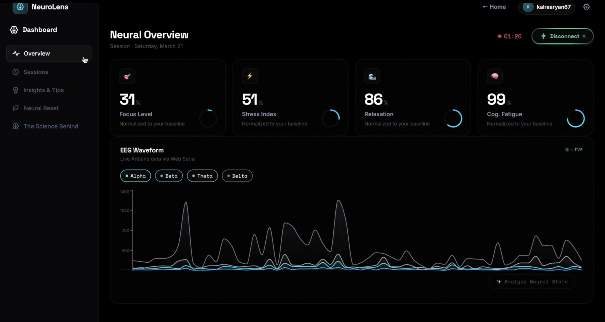
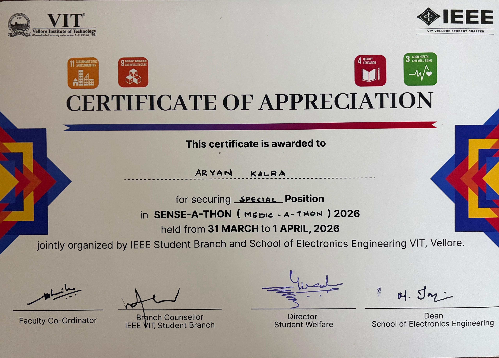
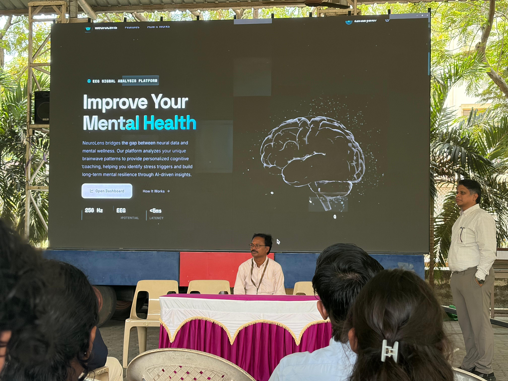
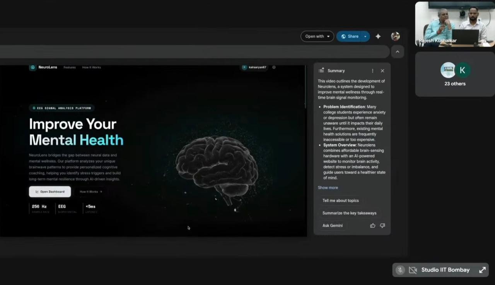

<div align="center">


# NeuroLens

**Real-Time Cognitive Monitoring & AI-Driven Insights**

[](https://opensource.org/licenses/MIT)


A modular neuro-feedback system that provides a data-driven window into mental wellness, combining precision EEG hardware with an intelligent web dashboard and AI-powered retrospective analysis.

</div>

---

## Overview

NeuroLens is a physiological computing ecosystem that moves beyond traditional biofeedback tools. It captures high-fidelity brain activity in real time, visualizes four key cognitive states, triggers targeted mental interventions, and learns from your session history to surface personalized insights.

```
Hardware Sensing → Real-Time Dashboard → Neural Intervention → AI Retrospective Analysis
```

---

## System Architecture

<div align="center">
  
</div>

---

## Features

### 🧠 Real-Time EEG Monitoring
Live visualization of four cognitive states derived from raw EEG signals:

| State | Description | Color |
|---|---|---|
| **Focus** | Deep work capacity, beta/gamma band activity | `#00d4e8` |
| **Stress** | High-tension triggers, elevated sympathetic response | `#f5a623` |
| **Fatigue** | Burnout and exhaustion levels, theta suppression | `#9b8fe0` |
| **Relaxation** | Ability to decompress, alpha band dominance | `#34c97a` |

### 📊 Dashboard & Session History

<div align="center">
  
</div>

The main dashboard displays live arc gauges for all four cognitive states: Focus, Relaxation, Stress, and Cognitive Fatigue, updated in real time as EEG data streams in via Web Serial. Below the gauges, frequency band graphs continuously plot the power of Delta, Theta, Alpha, and Beta waves, giving a direct view of the underlying neural activity driving each metric.

The **Session History** page stores every completed session to Supabase. Past sessions appear as date-grouped cards showing average values for each cognitive state. Any session with sustained high stress or elevated fatigue is flagged, making it easy to identify patterns across days.

- Live arc gauges per cognitive state
- Real-time Delta, Theta, Alpha, and Beta band power graphs
- Date-grouped session cards with per-session averages
- High stress / high fatigue flags on past sessions

### ⚡ Neural Reset: Targeted Intervention

When the dashboard detects sustained stress or fatigue above threshold, it triggers **Neural Reset**, a guided recalibration session powered by Nora, the in-app EEG wellness coach.

<div align="center">
  
</div>

- Structured **box breathing** with animated visual guides
- **Guided meditation** segments with pre-recorded audio
- Supabase-backed **streak tracking** and session calendar

<<<<<<< HEAD
=======
### 📊 Dashboard & Session History

<div align="center">
  
</div>

- Arc gauges per cognitive state with live updates via Web Serial API
- Date-grouped session cards with summary strips
- Stress alert banner on sustained threshold breach
- Session replay and historical trend graphs

>>>>>>> b740181ef4d367a449fca7eb5ec9865564bbc141
### 🤖 Retrospective Neural Analysis
AI-powered post-session insights via LLM integration:
- Pattern identification across sessions
- Personalized cognitive health recommendations
- Trend analysis beyond simple charts

---

## Hardware

<div align="center">
  
</div>

| Component | Role |
|---|---|
| **Arduino Uno R4 WiFi** | Microcontroller |
| **BioAmp EXG Pill** | EEG signal acquisition |
| **Gel Electrodes** | Signal capture from scalp |

**Signal Pipeline:**
1. BioAmp EXG Pill captures raw EEG at the scalp
2. Butterworth IIR filters (on-device) remove noise and isolate frequency bands
3. Data transmitted to browser via **Web Serial API** (low-latency, no backend relay)
4. Browser-side **FFT analysis** computes band power

---

## Tech Stack

**Frontend**
- React + Vite
- Web Serial API (hardware bridge)
- FFT band-power analysis (in-browser)
- CSS: Space Grotesk / Inter / Space Mono, glassmorphism dark theme

**Backend & Data**
- Supabase (session storage, streak system, user data)
- OpenAI API (retrospective analysis)

**Hardware / Firmware**
- Arduino Uno R4 WiFi / ESP32
- BioAmp EXG Pill
- C++ (Butterworth IIR filters, envelope detection)

---

## Getting Started

### Prerequisites
- Node.js >= 18
- A Chromium-based browser (Web Serial API support)
- Arduino Uno R4 WiFi + BioAmp EXG Pill hardware setup
- Supabase project + OpenAI API key

### Installation

```bash
git clone https://github.com/aryankalra404/neurolens.git
cd neurolens
npm install
```

### Environment Setup

Create a `.env` file in the project root:

```env
VITE_SUPABASE_URL=your_supabase_url
VITE_SUPABASE_ANON_KEY=your_supabase_anon_key
VITE_OPENAI_API_KEY=your_openai_api_key
```

### Run

```bash
npm run dev
```

Then connect your hardware, open the dashboard, and hit **Connect Device** to pair via Web Serial.

### Flash Firmware

Open `hardware/eeg.ino` in Arduino IDE, select your board (Uno R4 WiFi), and upload.

---

## XR Integration

Traditional meditation is hard. For many, sitting still feels impossible due to constant mental noise. While web dashboards track metrics well, they lack the immersion needed to keep a user genuinely engaged.

NeuroLens addresses this by translating real-time EEG signals into an XR layer, extending the platform from screen to space.

### VR Flow State
Peaceful VR environments help users reach a flow state significantly faster than traditional eyes-closed meditation. Real-time brainwave data drives the environment, creating a feedback loop between mental state and immersion level.

### AR Neural Coaching
An Augmented Reality coach prototype uses live brainwave data to guide users through Neural Reset sessions when stress levels spike, bringing Nora out of the browser and into the physical world.

<div align="center">
  
  &nbsp;&nbsp;&nbsp;&nbsp;&nbsp;&nbsp;&nbsp;&nbsp;&nbsp;&nbsp;&nbsp;&nbsp;
  
</div>

```
EEG Signal -> Cognitive State Score -> XR Environment Response
```

---

## Project Structure

```
neurolens/
├── README.md
├── eslint.config.js
├── index.html
├── package.json
├── vite.config.js
├── assets/
├── hardware/
│   └── eeg.ino                 # Arduino firmware
├── public/
│   ├── sounds/                 # Audio assets (Nora meditation)
│   ├── EEG.jpg
│   ├── FFT.jpg
│   ├── calibration.jpg
│   ├── nora.png
│   ├── neuro.mp4
│   ├── favicon.svg
│   └── icons.svg
└── src/
    ├── App.css
    ├── App.jsx
    ├── index.css
    ├── main.jsx
    ├── components/             # Reusable UI components
    ├── contexts/
    │   ├── AuthContext.jsx
    │   └── ThemeContext.jsx
    ├── hooks/
    │   └── useSerial.js
    ├── lib/
    │   └── supabase.js
    ├── pages/
    │   ├── Dashboard.jsx/css   # Main EEG dashboard
    │   ├── Landing.jsx/css     # Landing page
    │   ├── Login.jsx/css       # Auth
    │   └── Signup.jsx/css      # Auth
    └── utils/
        └── eegProcessor.js
```

---

## 🎖️ Recognition & Validation

- **Special Position (Best Freshman Team)** - *SENSE-A-THON 2026*
  - Awarded by IEEE VIT & SENSE for excellence in medical-tech integration.
- **Project Recognition** - *FOSSEE Arduino Day 2026, IIT Bombay*
  - Commended for developing a low-cost, modular solution to improve mental health.
- **Selected Finalist (Top 20)** - *VIT Student Innovation Contest 2026*
  - Showcased real-time dashboard to university leadership and industry evaluators.
 
<p align="center">
  
  
  
</p>
    
---

## License

MIT © Aryan
