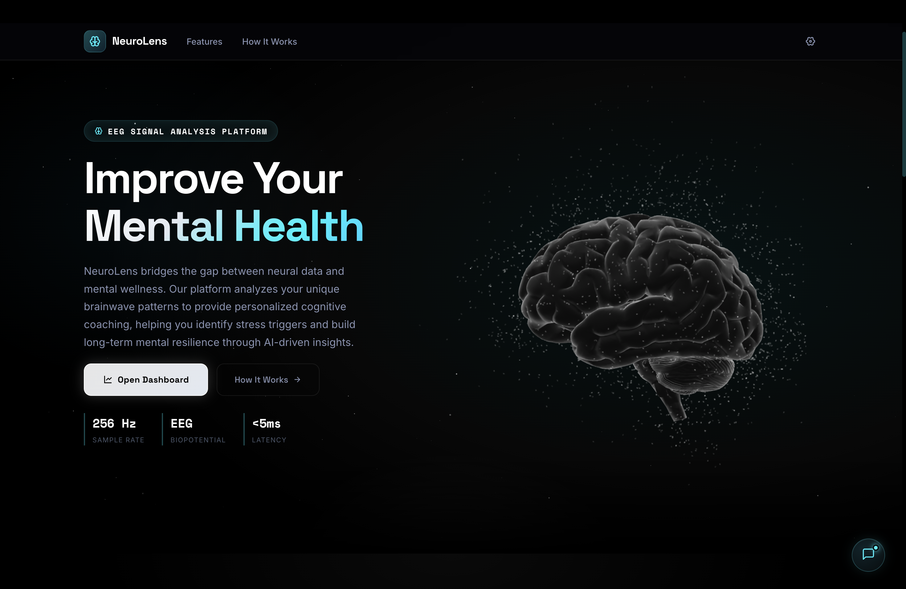
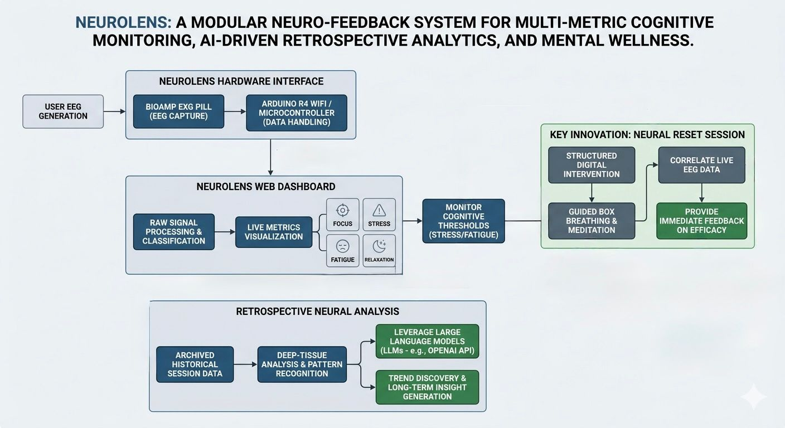
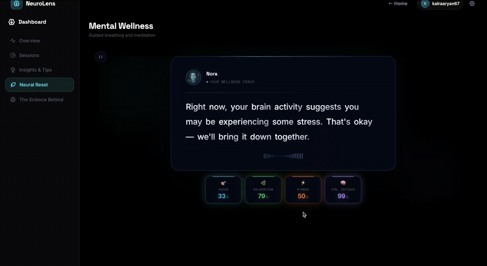
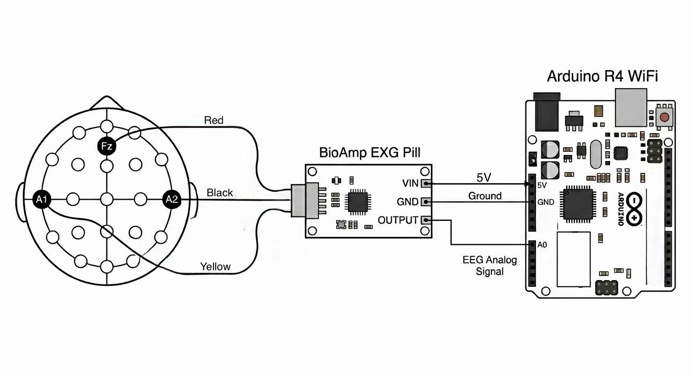
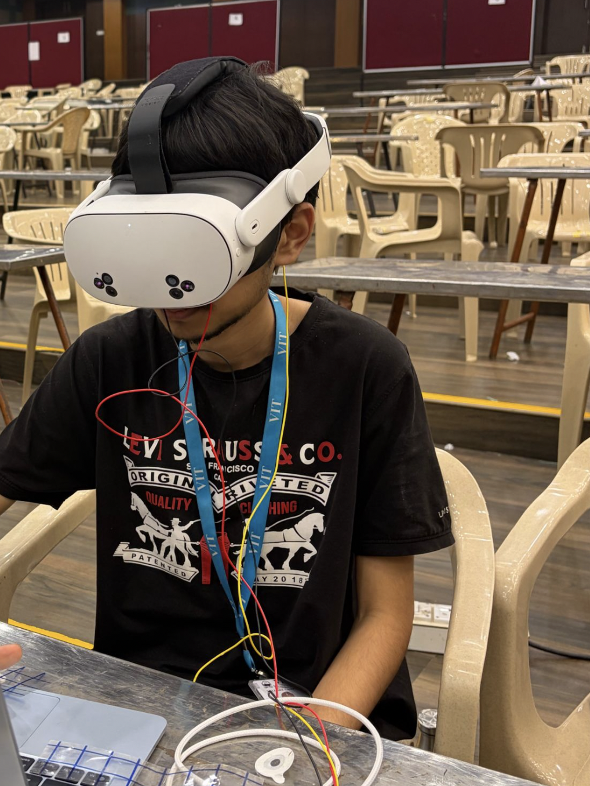
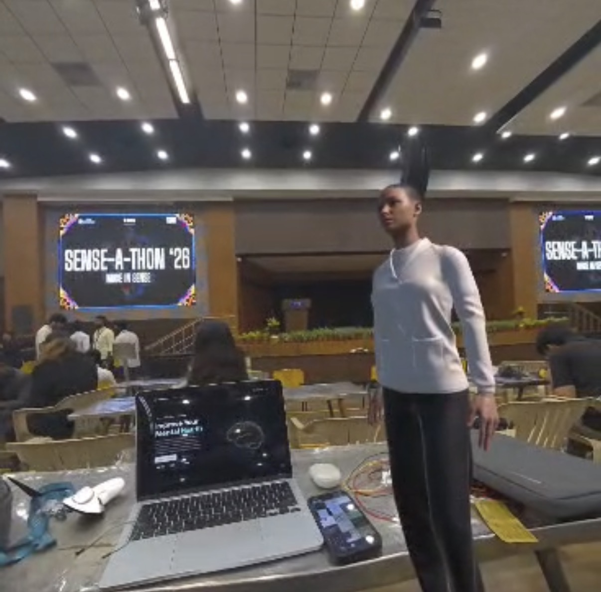

<div align="center">



# NeuroLens

**Real-Time Cognitive Monitoring & AI-Driven Insights**

[](https://opensource.org/licenses/MIT)


A modular neuro-feedback system that provides a data-driven window into mental wellness, combining precision EEG hardware with an intelligent web dashboard and AI-powered retrospective analysis.

</div>

---

## Overview

NeuroLens is a physiological computing ecosystem that moves beyond traditional biofeedback tools. It captures high-fidelity brain activity in real time, visualizes four key cognitive states, triggers targeted mental interventions, and learns from your session history to surface personalized insights.

```
Hardware Sensing → Real-Time Dashboard → Neural Intervention → AI Retrospective Analysis
```

---

## System Architecture

<div align="center">
  
</div>

---

## Features

### 🧠 Real-Time EEG Monitoring
Live visualization of four cognitive states derived from raw EEG signals:

| State | Description | Color |
|---|---|---|
| **Focus** | Deep work capacity, beta/gamma band activity | `#00d4e8` |
| **Stress** | High-tension triggers, elevated sympathetic response | `#f5a623` |
| **Fatigue** | Burnout and exhaustion levels, theta suppression | `#9b8fe0` |
| **Relaxation** | Ability to decompress, alpha band dominance | `#34c97a` |

### ⚡ Neural Reset — Targeted Intervention

When the dashboard detects sustained stress or fatigue above threshold, it triggers **Neural Reset** — a guided recalibration session powered by Nora, the in-app EEG wellness coach.

<div align="center">
  
</div>

- Structured **box breathing** with animated visual guides
- **Guided meditation** segments with pre-recorded audio
- Live EEG correlation during breathing cycles — see the reset working in real time
- Supabase-backed **streak tracking** and session calendar

### 📊 Dashboard & Session History

<div align="center">
  
</div>

- Arc gauges per cognitive state with live updates via Web Serial API
- Date-grouped session cards with summary strips
- Stress alert banner on sustained threshold breach
- Session replay and historical trend graphs

### 🤖 Retrospective Neural Analysis
AI-powered post-session insights via LLM integration:
- Pattern identification across sessions
- Personalized cognitive health recommendations
- Trend analysis beyond simple charts

---

## Hardware

<div align="center">
  
</div>

| Component | Role |
|---|---|
| **Arduino Uno R4 WiFi / ESP32** | Microcontroller & Wi-Fi transmission |
| **BioAmp EXG Pill** | High-fidelity EEG/EMG signal acquisition |
| **Gel Electrodes** | Signal capture from scalp |

**Signal Pipeline:**
1. BioAmp EXG Pill captures raw EEG at the scalp
2. Butterworth IIR filters (on-device) remove noise and isolate frequency bands
3. Envelope detection extracts band power signals
4. Data transmitted to browser via **Web Serial API** (low-latency, no backend relay)
5. Browser-side **FFT analysis** computes band power → cognitive state scores

---

## Tech Stack

**Frontend**
- React + Vite
- Web Serial API (hardware bridge)
- FFT band-power analysis (in-browser DSP)
- CSS: Space Grotesk / Inter / Space Mono, glassmorphism dark theme

**Backend & Data**
- Supabase (session storage, streak system, user data)
- OpenAI API (retrospective analysis)

**Hardware / Firmware**
- Arduino Uno R4 WiFi / ESP32
- BioAmp EXG Pill
- C++ (Butterworth IIR filters, envelope detection)

---

## Getting Started

### Prerequisites
- Node.js ≥ 18
- A Chromium-based browser (Web Serial API support)
- Arduino Uno R4 WiFi or ESP32 + BioAmp EXG Pill hardware setup
- Supabase project + OpenAI API key

### Installation

```bash
git clone https://github.com/aryankalra404/neurolens.git
cd neurolens
npm install
```

### Environment Setup

Create a `.env` file in the project root:

```env
VITE_SUPABASE_URL=your_supabase_url
VITE_SUPABASE_ANON_KEY=your_supabase_anon_key
VITE_OPENAI_API_KEY=your_openai_api_key
```

### Run

```bash
npm run dev
```

Then connect your hardware, open the dashboard, and hit **Connect Device** to pair via Web Serial.

### Flash Firmware

Open `hardware/eeg.ino` in Arduino IDE, select your board (Uno R4 WiFi), and upload.

---

## XR Integration

Traditional meditation is hard. For many, sitting still feels impossible due to constant mental noise. While web dashboards track metrics well, they lack the immersion needed to keep a user genuinely engaged.

NeuroLens addresses this by translating real-time EEG signals into an XR layer, extending the platform from screen to space.

### VR Flow State
Peaceful VR environments help users reach a flow state significantly faster than traditional eyes-closed meditation. Real-time brainwave data drives the environment, creating a feedback loop between mental state and immersion level.

### AR Neural Coaching
An Augmented Reality coach prototype uses live brainwave data to guide users through Neural Reset sessions when stress levels spike — bringing Nora out of the browser and into the physical world.

<div align="center">
  
  &nbsp;&nbsp;&nbsp;&nbsp;&nbsp;&nbsp;&nbsp;&nbsp;&nbsp;&nbsp;&nbsp;&nbsp;
  
</div>

```
EEG Signal → Cognitive State Score → XR Environment Response
```

---

## Project Structure

```
neurolens/
├── hardware/
│   └── eeg.ino                 # Arduino / ESP32 firmware
├── public/
│   ├── sounds/                 # Audio assets (Nora meditation)
│   ├── EEG.jpg
│   ├── FFT.jpg
│   ├── calibration.jpg
│   ├── nora.png
│   ├── neuro.mp4
│   ├── favicon.svg
│   └── icons.svg
├── src/
│   ├── assets/
│   ├── components/             # Reusable UI components
│   ├── contexts/               # React context providers
│   ├── hooks/                  # Custom hooks (Web Serial, FFT, Supabase)
│   ├── lib/                    # Signal processing utilities
│   ├── pages/
│   │   ├── Dashboard.jsx/css   # Main EEG dashboard
│   │   ├── Landing.jsx/css     # Landing page
│   │   ├── Login.jsx/css       # Auth
│   │   └── Signup.jsx/css      # Auth
│   ├── utils/
│   ├── App.jsx / App.css
│   ├── main.jsx
│   └── index.css
├── assets/                     # README images
├── .env.local
├── index.html
├── vite.config.js
└── README.md
```

---

## License

MIT © Aryan